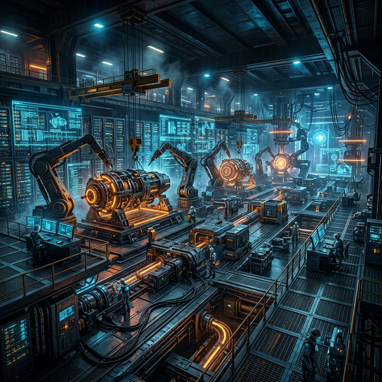

# DepredadorCloud: Centro de Informática y Mecánica Pesada

Bienvenido al repositorio oficial del portal web de **DepredadorCloud**, el epicentro soberano ubicado en **El Salvador** que fusiona la potencia computacional con la fuerza imparable de la maquinaria industrial pesada.



## Overview

Este proyecto ha sido migrado a una arquitectura de **Flutter Web** para proporcionar una interfaz de usuario hiper-futurista, fluida y escalable. DepredadorCloud es un taller único que integra servicios de Informática Avanzada (Computer Science) y Mecánica Pesada en unas solas instalaciones.

## Arquitectura

El sitio utiliza las siguientes capacidades de Flutter:
- **UI Responsiva**: Adaptable a pantallas de escritorio y dispositivos móviles.
- **Cyber-Mechanic Theme**: Estética Dark Mode con acentos neon (Blue/Orange) y efectos de cristal (Glassmorphism).
- **Google Fonts (Outfit & Space Grotesk)**: Tipografía moderna que refuerza la identidad tecnológica.
- **Lucide Icons**: Iconografía técnica estilizada.

## Secciones del Portal
1. **Inicio**: Presentación de la sinergia industrial en El Salvador.
2. **Capacidades**:
   - **Infraestructura TI Soberana**: Despliegues orquestados por SISA, OMEGA-1 y Paul Kruger.
   - **Mecánica Pesada Automatizada**: Mantenimiento de motores y maquinaria industrial.
   - **Cyberseguridad**: Defensa de red basada en telemetría Palantir WEF.
   - **Agritech Satelital**: Gestión de flotas pesadas mediante datos en tiempo real.
3. **Nosotros**: Detalle sobre la base operativa de Juan Sabe y la visión soberana.

## Stack Tecnológico
- **Frontend**: Flutter Web (Canal Stable).
- **Styling**: Vanilla Flutter Widgets + Custom Gradients & Shadows.
- **CI/CD**: GitHub Actions (Automatización de compilación y despliegue a GitHub Pages).

## Desarrollo Local

Para ejecutar el portal localmente en modo desarrollo:

```bash
flutter pub get
flutter run -d chrome
```

Para realizar la compilación de producción:

```bash
flutter build web --base-href "/Depredadorcloud_Website/"
```

---
*Construyendo el Futuro de la Industria Automatizada desde El Salvador.*
*Operado por Juan Sabe Orchestrator - 2026.*
