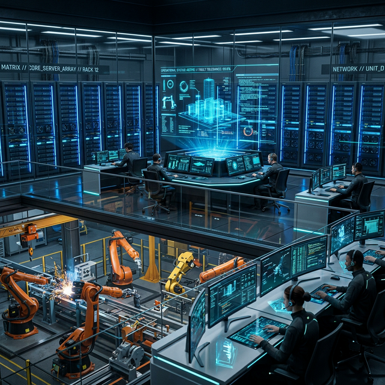
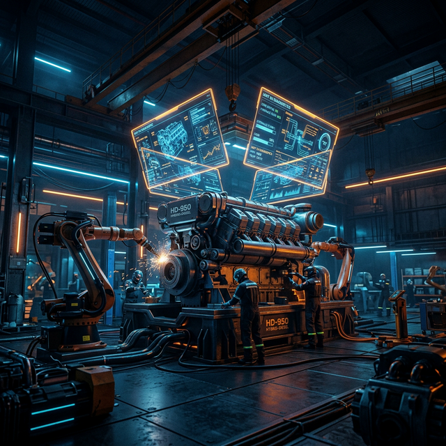

# DepredadorCloud: Centro de Informática y Mecánica Pesada

Bienvenido al repositorio oficial del portal web de **DepredadorCloud**, el epicentro soberano ubicado en **El Salvador** que fusiona la potencia computacional con la fuerza imparable de la maquinaria industrial pesada.


## Overview

Este proyecto ha sido migrado a una arquitectura de **Flutter Web** para proporcionar una interfaz de usuario hiper-futurista, fluida y escalable. DepredadorCloud es un taller único que integra servicios de Informática Avanzada (Computer Science) y Mecánica Pesada en unas solas instalaciones.

## Arquitectura & Visual Excellence

El sitio utiliza las siguientes capacidades y librerías de vanguardia en Flutter para asegurar un aspecto Ultra Premium y cinemático, compitiendo con los repositorios globales más élite:

- **Interactive 3D Cards**: Implementadas con `flutter_tilt` para lograr inclinaciones de eje tridimensional bajo el cursor junto a luz volumétrica y sombras magnéticas.
- **Particle Hub Matrix**: Fondo reactivo construido sobre `particles_flutter` que ajusta su densidad, líneas de red y color dependiendo del modo activo (Neural Blue para IT, Heat Sparks para Mecánica).
- **Core Boot Terminal**: Integración de `animated_text_kit` para generar un efecto en tiempo real de tipeo tipo consola de IA (Typewriter effect) ligado dinámicamente al sistema de traducciones.
- **Glassmorphism Dynamics**: Arquitectura moderna con `BackdropFilter` que brinda a cada sección una sensación física sobre pantallas borrosas y fondos oscuros inmersivos.
- **UI Responsiva**: Flujo estructurado sobre `responsive_framework`.
- **Google Fonts & Lucide Icons**: Sistemas contemporáneos `Outfit & Space Grotesk`.

### Previsualización Visual: Infraestructura y Maquinaria

<p align="center">
  
  &nbsp;
  
</p>

## Secciones del Portal
1. **Inicio**: Presentación de la sinergia industrial en El Salvador.
2. **Capacidades**:
   - **Infraestructura TI Soberana**: Despliegues orquestados por SISA, OMEGA-1 y Paul Kruger.
   - **Mecánica Pesada Automatizada**: Mantenimiento de motores y maquinaria industrial.
   - **Cyberseguridad**: Defensa de red basada en telemetría Palantir WEF.
   - **Agritech Satelital**: Gestión de flotas pesadas mediante datos en tiempo real.
3. **Nosotros**: Detalle sobre la base operativa de Juan Sabe y la visión soberana.

## Stack Tecnológico
- **Frontend**: Flutter Web (Canal Stable).
- **Styling**: Vanilla Flutter Widgets + Custom Gradients & Shadows.
- **CI/CD**: GitHub Actions (Automatización de compilación y despliegue a GitHub Pages).

## Desarrollo Local

Para ejecutar el portal localmente en modo desarrollo:

```bash
flutter pub get
flutter run -d chrome
```

Para realizar la compilación de producción:

```bash
flutter build web --base-href "/Depredadorcloud_Website/"
```

---
*Construyendo el Futuro de la Industria Automatizada desde El Salvador.*
*Operado por Juan Sabe Orchestrator - 2026.*
